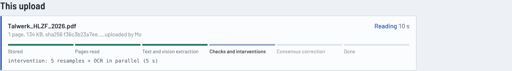
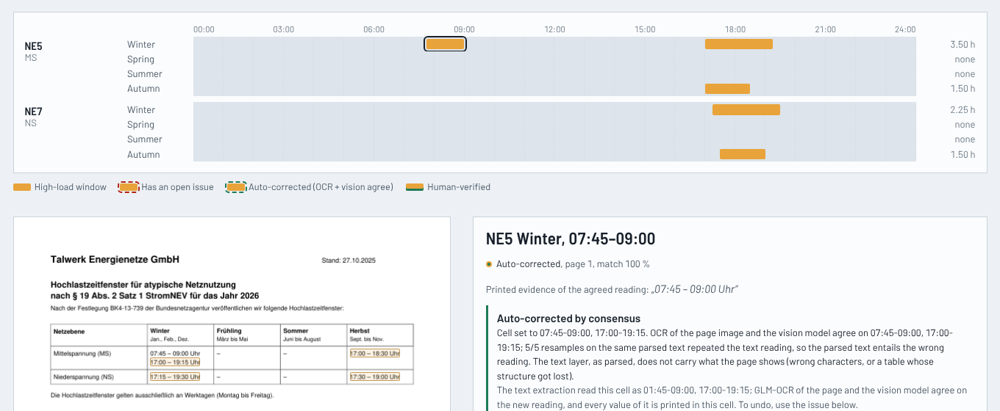
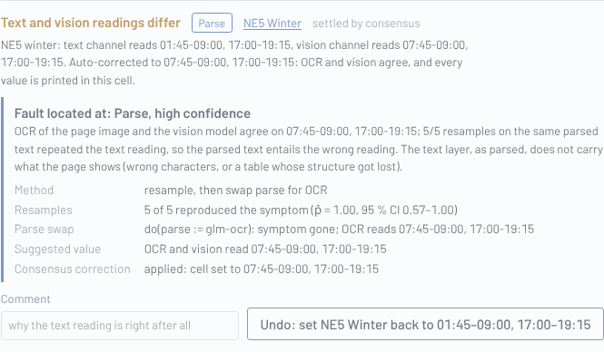

# HLZF provenance

The German grid operators (DSOs) I looked at publish their **Hochlastzeitfenster** (HLZF,
high-load time windows) as PDFs, each with its own table layout and wording. As far as I
understand it, a customer whose peak load stays out of these windows can get a reduced
grid fee, so software that plans load around them needs the windows as data, and I did not
find a database of them. This prototype reads the PDFs with an LLM and treats every extracted
value as a claim: it must be grounded in the PDF, cross-checked, and traceable back to the page
it came from.

```bash
git clone https://github.com/mohammadrwth/hlzf-provenance && cd hlzf-provenance
uv run hlzf fetch       # download the DSO PDFs (they are not in the repository)
uv run hlzf demo        # no API key needed; opens the review UI on http://127.0.0.1:8000
```

Needs Python 3.12 and [uv](https://docs.astral.sh/uv/) (`brew install uv` or
`curl -LsSf https://astral.sh/uv/install.sh | sh`). Without `hlzf fetch` the demo shows only the
synthetic test documents; with it, the real publications are replayed from the committed model
answers, so no API key is needed either way.

## What I know about the domain, and what I don't

I'm a computer scientist, not an energy-market expert. What this project knows about HLZF
comes from the publications themselves (listed in [`corpus.yaml`](corpus.yaml)) and from the
one ruling most of them cite, which I read for three defaults (linked where it is used). Where
the documents leave a case open (whether a time marks the start or the end of a quarter-hour,
which bridge day is meant, a holiday that depends on the municipality), the pipeline does not
decide on my behalf: it answers `uncertain` or sends the value to a person. My part is the
engineering: reading messy PDFs reliably, checking every value against its source, and the
fault localisation method from my bachelor thesis (below).

## What it does

1. **Extracts** the windows, empty cells and the rules printed next to them (holidays, bridge
   days, thresholds) from a DSO PDF with GLM-5.3 into a strict schema. The model reads
   layout-preserving text, so table cells stay in their columns. Every value must carry its
   page and a verbatim quote.
2. **Grounds** each value deterministically: the quote must be on the cited page, the value
   must equal the times printed in its own quote, and the quote must sit in the table cell
   (grid level x season) the value claims. No model judges another model's output.
3. **Cross-checks** with an independent channel: GLM-5.3-Flash reads the rendered page
   images, so a corrupted PDF text layer cannot fool both readings.
4. **Locates the faulty stage** when something is off, by intervention rather than by
   asking a model (the method of my bachelor thesis, below).
5. **Corrects by consensus.** When GLM-OCR of the page and the vision model agree on a
   disputed table cell against the text reading, and every agreed value is printed in that
   cell, the cell is set to it: a PROV revision by the software, marked `auto-corrected`,
   undoable in one click. Anything less clear-cut waits for a person.
6. **Records W3C PROV** for every value: which document, page, parser, model, prompt hash,
   sample, correction and human decision produced it. Any value exports as PROV-JSON.
7. **Lets a human review** values next to the page they came from: approve, edit or reject a
   value, or set a whole cell, each a PROV activity with a person as agent.
8. **Answers "is this quarter-hour inside a window?"** for any quarter-hour, with the
   provenance behind the answer, and exports a DST-correct 15-minute mask for a whole year.
9. **Takes any DSO's PDF.** Drop it into the UI (or `hlzf add file.pdf`) and it runs through
   the same pipeline in the background, with live progress. Grid operator and year are read
   from the document and matched to known operators, so an upload joins its other versions;
   the upload is a PROV activity with you as the agent; identical bytes are never processed
   twice.






*Synthetic test document "Talwerk" (fictional DSO): its invisible OCR text layer misreads one
digit. Resampling the extractor reproduces the error 5 of 5 times, so the input carries it;
replacing the text layer with OCR of the page removes it, so the parse stage is at fault. OCR
and the vision model agree on 07:45, so the pipeline sets the cell and keeps the undo.*

## Architecture

```mermaid
flowchart LR
  REG["corpus.yaml<br/>+ corpus.lock.json"] --> ACQ["acquire<br/>immutable PDFs, sha256,<br/>change detection"]
  ACQ --> PAR["parse<br/>layout text (pdfplumber),<br/>line boxes (PyMuPDF),<br/>text-layer health"]
  PAR -- "empty or garbled page" --> OCR["GLM-OCR<br/>layout_parsing"]
  OCR --> EXT
  PAR --> EXT["extract<br/>GLM-5.3, JSON mode,<br/>page + quote per value"]
  PAR --> VIS["vision check<br/>GLM-5.3-Flash<br/>on page images"]
  EXT --> NOR["normalize<br/>NE1-NE7, seasons, minutes,<br/>convention, typed rules"]
  NOR --> GRD["ground<br/>quote on page, value = quote,<br/>cell geometry"]
  GRD --> VAL["validate<br/>10 rule families"]
  VIS --> VAL
  VAL -- "cause unclear" --> ATT["attribute<br/>resample extract x5,<br/>swap parse for OCR"]
  VAL --> REV["review UI<br/>approve / edit / reject,<br/>set a cell, undo"]
  ATT -- "OCR = vision,<br/>printed in the cell" --> COR["consensus correction<br/>PROV revision by software"]
  ATT -- "otherwise" --> REV
  COR --> REV
  REV --> OUT["query API, 15-min mask,<br/>PROV-JSON"]
```



Every arrow is a PROV activity with an agent (software version, model id and prompt hash, or
a person); every box output is a PROV entity. Stages are idempotent: a document is reprocessed
only when its PDF hash, prompt version, models or code version change, and model responses are
cached by request, so a committed cache replays a full run without an API key.

**Stack:** Python 3.12, uv, pydantic v2, typer, PyMuPDF, rapidfuzz, holidays, SQLite, FastAPI +
Jinja2 + HTMX (no JS build). Z.ai GLM over the OpenAI-compatible API.

## Results

<!-- results:start -->
**Real DSO publications** (live GLM run; human-labeled where a golden file exists)

| Document | DSO | Year | Windows | Auto-corrected | Sent to review | Errors / warnings | Convention | Status |
|---|---|---|---|---|---|---|---|---|
| `n-ergie-2024` | N-ERGIE Netz GmbH | 2024 | 15 | 0 | 0 | 0 / 1 | assumed | caveats |
| `n-ergie-2026` | N-ERGIE Netz GmbH | 2026 | 17 | 2 | 0 | 0 / 1 | assumed | caveats |
| `wunsiedel-2024` | SWW Wunsiedel GmbH | 2024 | 7 | 0 | 0 | 0 / 2 | assumed | caveats |
| `bayreuth-2026-korr` | Stadtwerke Bayreuth | 2026 | 11 | 0 | 0 | 0 / 3 | interval_end_labels | needs-review |
| `dettelbach-2026` | Stadtwerke Dettelbach | 2026 | 19 | 0 | 0 | 0 / 2 | assumed | caveats |
| `passau-2024` | Stadtwerke Passau GmbH | 2024 | 11 | 0 | 0 | 0 / 3 | interval_end_ambiguous | caveats |
| `passau-2026` | Stadtwerke Passau GmbH | 2026 | 8 | 0 | 0 | 0 / 3 | interval_end_ambiguous | caveats |
| `ratingen-2024` | Stadtwerke Ratingen Netze | 2024 | 7 | 1 | 0 | 0 / 3 | interval_end_physical | caveats |
| `ratingen-2026` | Stadtwerke Ratingen Netze | 2026 | 16 | 0 | 0 | 0 / 2 | interval_end_physical | caveats |
| `schweinfurt-2025` | Stadtwerke Schweinfurt GmbH | 2025 | 9 | 0 | 0 | 0 / 2 | assumed | caveats |
| `schweinfurt-2026` | Stadtwerke Schweinfurt GmbH | 2026 | 15 | 0 | 0 | 0 / 2 | assumed | caveats |
| `waldmuenchen-2026` | Stadtwerke Waldmünchen | 2026 | 6 | 0 | 0 | 0 / 1 | assumed | caveats |

_Auto-corrected: values set by the consensus correction (GLM-OCR and the vision model agree against the text reading, every value printed in that cell). Status `caveats`: every value checked out, but the document itself leaves something open (no quarter-hour convention, a holiday period without dates); a person acknowledges that once._

Accuracy against human-verified golden files:

| Document | Labeled by | Raw extraction P / R | Delivered P / R | Cells exact | Auto-corrected | Wrong / missing flagged | Convention | Rules recall | Review share | Cost | Latency |
|---|---|---|---|---|---|---|---|---|---|---|---|
| `bayreuth-2026-korr` | Mo | 100 % / 100 % | 100 % / 100 % | 16/16 | 0 | none wrong or missing | – | 100 % | 0 % | $0.015 | 43 s |
| `n-ergie-2026` | Mo | 94 % / 94 % | 100 % / 100 % | 20/20 | 2 | none wrong or missing | – | 100 % | 0 % | $0.108 | 227 s |
| `wunsiedel-2024` | Mo | 100 % / 100 % | 100 % / 100 % | 12/12 | 0 | none wrong or missing | – | 100 % | 0 % | $0.010 | 47 s |

**Synthetic test corpus** (fictional DSOs, ground truth by construction, scripted responses with injected faults; tests the checks, not the model)

| Document | Raw extraction P / R | Delivered P / R | Cells exact | Auto-corrected | Wrong / missing flagged | Convention | Rules recall | Review share |
|---|---|---|---|---|---|---|---|---|
| `musterstadt-2026` | 100 % / 86 % | 100 % / 100 % | 12/12 | 1 | none wrong or missing | ✓ | 100 % | 0 % |
| `alpenland-2025` | 100 % / 100 % | 100 % / 100 % | 20/20 | 0 | none wrong or missing | ✓ | 100 % | 0 % |
| `alpenland-2026` | 93 % / 93 % | 100 % / 100 % | 20/20 | 1 | none wrong or missing | ✓ | 100 % | 0 % |
| `beispielstadt-2026` | 100 % / 100 % | 100 % / 100 % | 16/16 | 0 | none wrong or missing | ✓ | 100 % | 0 % |
| `beispielstadt-2026-korr` | 100 % / 100 % | 100 % / 100 % | 16/16 | 0 | none wrong or missing | ✓ | 100 % | 0 % |
| `quellbach-2026` | 100 % / 100 % | 100 % / 100 % | 16/16 | 0 | none wrong or missing | ✓ | 100 % | 21 % |
| `talwerk-2026` | 80 % / 80 % | 100 % / 100 % | 8/8 | 1 | none wrong or missing | ✓ | 100 % | 0 % |
| `nordheim-2026` | 100 % / 100 % | 100 % / 100 % | 8/8 | 0 | none wrong or missing | ✓ | 100 % | 0 % |

**Fault attribution on injected faults**

| Document | Issue | Injected at | Verdict | Method | p̂ (persisted) | Confidence | Auto-corrected |
|---|---|---|---|---|---|---|---|
| `musterstadt-2026` | COVERAGE_GAP | extract | extract ✓ | resample | 0.00 | high | – |
| `musterstadt-2026` | CROSS_CHECK_DISAGREE | extract | extract ✓ | resample+swap | 0.00 | high | yes |
| `alpenland-2026` | GROUNDING_VALUE_MISMATCH | extract | extract ✓ | resample | 0.00 | high | – |
| `talwerk-2026` | CROSS_CHECK_DISAGREE | parse | parse ✓ | resample+swap | 1.00 | high | yes |
| `quellbach-2026` | TIME_INVALID | source_document | source_document ✓ | channel_agreement | – | high | – |
| `quellbach-2026` | DAILY_CAP_EXCEEDED | source_document | source_document ✓ | channel_agreement | – | high | – |
<!-- results:end -->

The block above is generated by `hlzf eval --write-readme`. The column that matters most is
*wrong windows sent to review*: an extraction error is acceptable, an error that reaches
whoever uses the data silently is not. The synthetic corpus (fictional operators, see
[`fixtures.py`](src/hlzf/fixtures.py)) exists to test the checks and the attribution against a
known truth; it says nothing about GLM's accuracy on real PDFs. That is what the golden files in
[`golden/`](golden/) are for: three real documents labeled by hand from the PDF.

## What the real publications taught me

Found while building the corpus and in the live runs (2026-10-03); each one changed the design.

- **The text layer loses the table, and the attribution said so.** In the first live run the
  extractor read plain text in content-stream order. For SWW Wunsiedel 2024 that order is
  scrambled (labels, then cells from different rows), and 6 of 7 windows landed in the wrong
  season or level. For N-ERGIE 2026 the empty spring and summer columns vanish from the text,
  so the autumn windows were read as winter and then "overlapped" the real winter windows.
  Every wrong window went to review, because the vision model disagreed in each of those cells.
  In all 15 disputed cells, GLM-OCR of the page image read the same as the vision model, and
  the attribution put 11 of them on the parse stage, the other 4 on a single bad sample. So
  the fix went into the parse stage: the extractor now reads layout-preserving text, in which
  every character keeps its position and the columns line up. The same layouts vary widely
  across the corpus: transposed tables (Schweinfurt), one table per level (Passau), start and
  end times in separate "von"/"bis" columns (Ratingen, Dettelbach).
- **Second live run, all 12 publications ($0.72 in total).** Against the hand labels,
  Wunsiedel and Bayreuth are exact (7/7 and 11/11 windows). The extractor read N-ERGIE 2026
  with one row shift: in the layout text the NE7 window 11:00–12:30 sits on the line between
  "Niederspannung MS/NS" and "Niederspannung NS", and the model put it into NE6. The
  cross-check flagged both cells with the right reading, but flagging left a wrong value in
  the data until a person acted, and in the review UI the wrong value looked fine (its quote
  is on the page). The fix is the consensus correction: GLM-OCR and the vision model agreed
  on both cells, 3 of 5 resamples too, and both values are printed in the claimed cells, so
  the pipeline set them. The same rule fixed N-ERGIE 2024 (the same shift, one row higher) and
  Schweinfurt 2025 (two autumn values one column off); all three checked against the page
  images. Delivered output against the hand labels: 7/7, 11/11, 17/17 windows. The run also
  exposed noise in the checks, fixed and verified by replaying the cached answers: quotes
  copied from a layout-text table row are now grounded in that row; a range printed in two
  cells no longer counts as misaligned when one of them is the claimed cell; a blank cell that
  both channels read as blank is empty rather than a coverage gap. Eleven of the twelve
  documents need no value review, only a one-time acknowledgement of what the document itself
  leaves open; Bayreuth asks to confirm the corrected convention (below).
- **Third live run: the table's ruling lines in the layout text.** The horizontal rules now
  appear in the layout text as rows of `─`, and the prompt says that the text between two rules
  is one table row. N-ERGIE 2024 and Schweinfurt 2025 now come out right with no correction (the
  extraction equals the corrected output of the second run), and so does the N-ERGIE 2026 row.
  Two errors remain, and the consensus correction catches both: in N-ERGIE 2026 the model put
  the second NE7 window into autumn (it noted itself that it could not place that row's values
  under a season), and in Ratingen 2024 it missed one spring window. Auto-corrected values
  across the twelve publications went from 7 to 3; delivered output against the hand labels
  stays at 100 %.

- **The same sentence means two things.** Stadtwerke Ratingen and Stadtwerke Passau both say
  their times are the *end* of a quarter-hour. Ratingen adds a worked example (window
  08:00–11:30 = meter stamps 08:15–11:30), which makes the window the physical span. Passau
  does not, so read literally its windows might start 15 minutes earlier. The pipeline does not
  guess: it marks that first quarter-hour of every Passau window as `uncertain`. Bayreuth says
  a third thing: "Die angegebenen Viertelstunden sind Zeitstempel" and "Der Zeitstempel 09:15
  Uhr definiert den Zeitraum von 09:00 Uhr bis 09:15 Uhr". Its listed times *are* meter stamps,
  so its 10:15–14:15 window starts at 10:00. GLM-5.3 read the stamp definition as a Ratingen-style
  window example and got the opposite convention, which would have silently dropped the first
  quarter-hour of all 11 Bayreuth windows. A deterministic check now accepts a worked example
  only if the page maps a window range onto a timestamp range, and corrects the reading with
  the two sentences as evidence (`CONVENTION_CORRECTED`).
- **A correction that hides the old value.** Stadtwerke Bayreuth re-published its 2026 windows on
  16.12.2025 because the Mittelspannung winter window was wrong. The corrected PDF marks the new
  time but does not print the old one, so whoever did not archive the first version cannot tell
  what changed. Hence immutable downloads, a lock file with hashes, and `hlzf fetch` reporting a
  replaced file instead of overwriting it.
- **Holidays differ per operator.** N-ERGIE Netz counts only holidays valid in its whole
  network area (which, its document says, spans Bavaria and Baden-Württemberg) and names Mariä
  Himmelfahrt as an exception; Stadtwerke Schweinfurt counts only nationwide holidays; Passau
  counts Bavarian ones. So the pipeline reads the holiday rule from each document instead of
  assuming one per state. In Bavaria, Mariä Himmelfahrt is a holiday only in some
  municipalities, so without the site's municipality the query answers `uncertain` for that day.
- **Bridge days go both ways.** SWW Wunsiedel and N-ERGIE count bridge days as working days;
  Bayreuth, Ratingen and Passau make "at most one bridge day" off-peak without naming which. The
  query answers `uncertain` on those days rather than inventing a choice.
- **Windows can be one quarter-hour long.** N-ERGIE 2026 lists 16:00–16:15 and 17:00–17:15 for
  Hochspannung next to multi-hour windows, so the schema keeps windows exactly as printed, never
  merged or rounded.
- **Three defaults come from the ruling the publications cite.** Eight of the twelve PDFs name
  the Bundesnetzagentur's ruling BK4-13-739 as their basis. Its section 2.e
  ([copy on the Lower Saxony regulator's site](https://www.regulierung.niedersachsen.de/download/145339))
  caps windows at 10 h per day and season, makes 24.12.–01.01. off-peak and allows at most one
  bridge day per week as off-peak. The pipeline uses the 10 h cap only as a plausibility
  warning, and the other two only where a document is silent: the Christmas period then
  defaults to 24.12.–01.01., and a bridge day becomes `uncertain`.

## The Htrace connection

My bachelor thesis, [Htrace](https://github.com/mohammadrwth/htrace), records an LLM-assisted
human-in-the-loop data-cleaning session as a typed causal graph and localises faults by
intervention: it resamples the generated implementation under a fixed human intent and measures
whether the symptom survives (Wilson interval, thresholds 0.6/0.4, a quorum of evaluable
samples). This prototype applies the same method to a document pipeline. *do(resample extract |
parse fixed)*: if a wrong value keeps reappearing, the input entails it and the fault is
upstream; if it disappears, the extraction was at fault. Upstream faults get a second
intervention, *do(parse := GLM-OCR)* with model and prompt held fixed: the symptom vanishing
means the parsed text did not carry what the page shows, the symptom staying means the printed
document itself says it. When the text and vision channels disagree on a cell, both
interventions run and four readings decide: if OCR and vision agree against the text channel,
resamples that converge on the page's reading mean a bad sample (extract), resamples that
repeat the text reading or scatter mean the parsed text is at fault (parse). Scatter matters:
on Wunsiedel's scrambled text, resampling alone would have blamed the extractor.
Htrace treats a resample that passes as a verified patch; here the counterpart is the
consensus correction, which applies the reading two independent channels agree on and records
it as a revision whose agent is the software.
The graph uses W3C PROV instead of Htrace's own node vocabulary;
[`docs/htrace-prov-mapping.md`](docs/htrace-prov-mapping.md) maps one onto the other.

## Run it

```bash
uv run hlzf demo                      # synthetic corpus + any cached real runs, then the UI
cp .env.example .env                  # add ZAI_API_KEY for live runs
uv run hlzf fetch                     # download the registered DSO PDFs (no key needed)
uv run hlzf run --live                # extract, check, attribute; spend is capped by LLM_BUDGET_USD
uv run hlzf issues n-ergie-2026       # what was flagged, where, and which stage caused it
uv run hlzf serve                     # review UI; "Upload a PDF" adds new publications
uv run hlzf add ~/Downloads/HLZF_2026.pdf   # the same from the shell (--dso/--year optional)
uv run hlzf query --dso "N-ERGIE" --level NE5 --ts 2026-01-15T08:30+01:00 --explain
uv run hlzf export-mask --dso "N-ERGIE" --level NE5 --year 2026
uv run hlzf prov --window-id 42       # W3C PROV-JSON for one value
uv run hlzf diff n-ergie-2024 n-ergie-2026
uv run hlzf eval --write-readme       # accuracy vs. golden labels, cost, attribution
uv run pytest                         # 147 tests, no network, no key
```

Model calls that do not depend on each other (text and vision extraction, the five resamples
and the OCR of each page) run in parallel, `HLZF_PARALLEL` at a time (default 4); rate-limit
answers are retried with backoff, and the budget guard reserves each call's worst-case cost
before it starts.

**Uploads.** A PDF uploaded in the UI is checked (a PDF, not encrypted, at most 25 MB and 20
pages: `HLZF_UPLOAD_MAX_MB`, `HLZF_UPLOAD_MAX_PAGES`), stored unchanged in `data/uploads/` with
a registry of who added it when, and processed on a background thread; the page polls the
stages and opens the document when it is done. Hints (operator, year, federal states, source
URL) are optional; one that contradicts the document becomes an issue. `hlzf run` reprocesses
uploads like corpus documents (after a prompt change, for instance), and a removed upload
keeps its PROV record plus who withdrew it. Without a key an upload is stored and parsed, then
waits for a retry.

Responses from live runs are cached in `data/cache/` (committed), so `HLZF_OFFLINE=1` replays
them without a key; the PDFs themselves are not committed (third-party documents), so an
offline replay of real documents needs `hlzf fetch` first, and replays only if the DSO has not
changed the file since.

**Query semantics.** The unit is the quarter-hour. `--ts` names one quarter-hour and
`--ts-label start|end|dso` says whether the timestamp is its start, its end (several
publications say their times mark quarter-hour ends), or whatever the DSO's document says.
The answer is `true`, `false` or `uncertain`; uncertain means the publication does not decide
it (convention ambiguity, an unnamed bridge day, a municipality-dependent holiday). If, as I
understand it, a peak inside a window costs the reduced fee, a caller should treat `uncertain`
as inside. The API is the same: `GET /api/hlzf/check`.

## Limitations

- The real-document accuracy rests on three hand-labeled publications. That is a smoke test,
  not a benchmark; the table reports counts, and the synthetic corpus only tests the checks.
- Grounding proves a quote exists on its page and matches its value. Whether it sits in the
  right table cell is checked with line geometry, which is a heuristic: merged cells and
  unusual layouts can cause false alarms (they go to review) or misses (the vision
  cross-check is the second line of defence).
- Z.ai offers JSON mode, not schema-enforced output, so every response is validated with
  pydantic and repaired once. GLM-5.3 always reasons and is sampled at temperature 1:
  reruns differ, and reproducibility comes from the response cache only.
- GLM-OCR works live with a base64 PDF; unlike the docs say, its `bbox_2d` come in pixels of
  the rendered page. If OCR fails, the parse swap falls back to the vision reading and says
  that the intervention is then confounded (the model changes together with the parse stage).
- Layout text is only as good as the PDF's text positions. A scanned page without a text layer
  goes through OCR; a text layer whose characters differ from the print is caught by the vision
  cross-check, not by the parse stage.
- The consensus correction trusts two image-based readings over the text reading. Two models
  could misread a blurry page the same way; the guard is that every agreed value must be
  printed with exactly these times in the claimed cell of the PDF text layer (or of the OCR
  page, when the intervention showed the text layer to be wrong). `HLZF_AUTOCORRECT=0` turns
  it off, leaving the suggestion to a person.
- The convention check reads German phrasing with patterns. A worked example worded in a way
  the patterns do not recognise is downgraded to `interval_end_ambiguous`, which is the safe
  direction (the first quarter-hour becomes `uncertain`), and the issue says so.
- The tool reads windows and the rules printed next to them. It does not check whether a site
  qualifies for a reduced grid fee; that needs load data and more domain knowledge than I have.
- My reading of the rules is limited to what the publications and the one linked ruling say.
  Holidays, bridge days and the timestamp convention follow each document's wording; where the
  wording leaves a case open, the answer is `uncertain`, not my guess. Corrections from people
  who know the domain are welcome.
- Reprocessing a changed document starts its review over; earlier decisions stay in the PROV
  history but are not carried over automatically. Single user, no authentication.
- Not legal advice.

## Next steps

1. **Coverage.** More operators, and finding which DSO's windows apply to a site.
2. **Scheduled change detection.** The ruling the publications cite (section 2.b) sets
   31 October as the deadline for publishing the next year's windows. Poll the registered URLs
   in October (`hlzf fetch` already detects replaced files) and diff each new publication
   against the previous year.
3. **Other DSO documents.** The schema is "DSO publication → typed values with evidence", so
   other tables operators publish should fit the same pipeline; which ones are worth it is
   something I would need to learn from the people who use them.
4. **OpenLineage run events** next to PROV, so pipeline runs show up in standard lineage tools.

## Repository

```
src/hlzf/        pipeline (acquire, parse, extract, normalize, grounding, validate,
                 attribution, calendar, query, export, diff, review, prov), CLI, web UI;
                 fixtures.py generates the synthetic test corpus
corpus.yaml      registered DSO publications (15, 12 of them in Bavaria)
golden/          labeling templates for the hand-verified set
data/cache/      cached model responses (committed); data/raw, data/uploads, data/hlzf.db are
                 local
docs/            Htrace to PROV mapping, screenshots
tests/           unit, integration and live-path tests (API mocked)
```

Author: Mohammad Abdel Aziz. MIT licence. Synthetic test documents are fictional; DSO PDFs belong
to their publishers and are downloaded, not redistributed.
